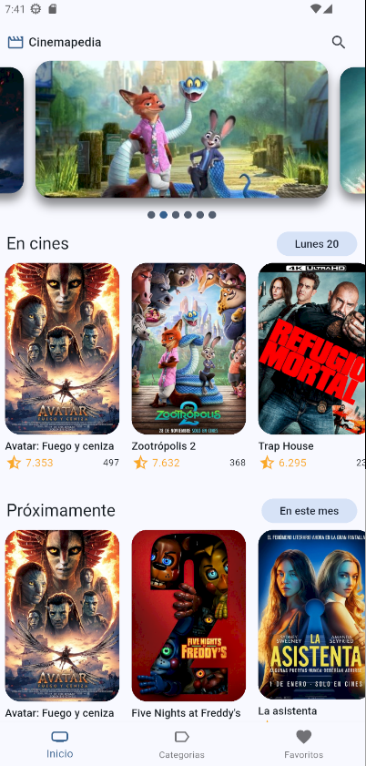
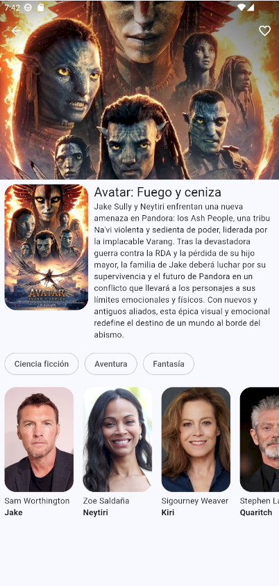
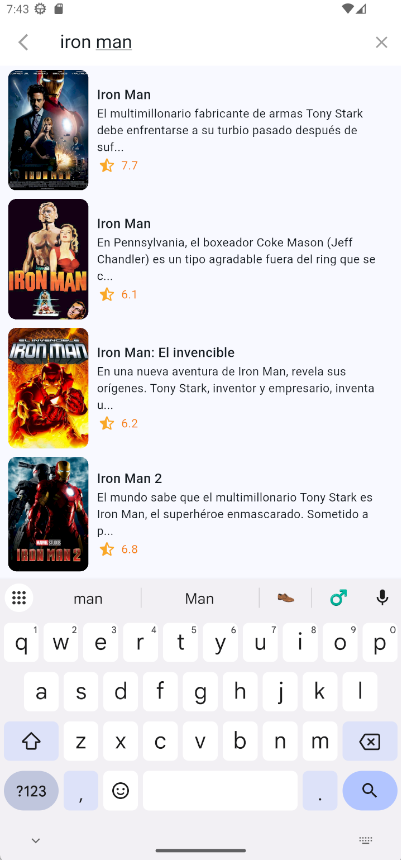

# 🎬 Flutter Cinema App

Aplicación móvil moderna para explorar películas usando The Movie Database (TMDB) API. Desarrollada con Flutter y siguiendo los principios de Clean Architecture.

## 📱 Características

- **Catálogo de Películas**: Visualización de películas organizadas en diferentes categorías:
  - En cines
  - Próximamente
  - Populares
  - Mejor calificadas
- **Detalles de Películas**: Información completa incluyendo sinopsis, géneros, calificación y reparto
- **Sistema de Favoritos**: Guarda y gestiona tus películas favoritas con almacenamiento local persistente
- **Búsqueda Inteligente**: Búsqueda de películas con debouncing para optimizar las consultas
- **Navegación Fluida**: Experiencia de usuario optimizada con animaciones y transiciones suaves
- **Carga Infinita**: Paginación automática para explorar catálogos extensos. 

## 🏗️ Arquitectura

El proyecto implementa **Clean Architecture** con una separación clara de responsabilidades:

### Capas Principales

- **Domain** (`lib/domain/`): Entidades y lógica de negocio.
- **Infrastructure** (`lib/infrastructure/`): Implementación de datasources, repositorios y mappers.
- **Presentation** (`lib/presentation/`): UI, widgets, providers y gestión de estado. 

### Estructura del Proyecto

```
lib/
├── config/
│   ├── database/      # Configuración de base de datos local (Drift)
│   ├── router/        # Configuración de rutas (Go Router)
│   └── theme/         # Temas y estilos de la aplicación
├── domain/
│   └── entities/      # Modelos de dominio
├── infrastructure/
│   ├── datasources/   # Fuentes de datos (API, Local DB)
│   ├── mappers/       # Transformación de datos
│   ├── models/        # Modelos de datos
│   └── repositories/  # Implementación de repositorios
└── presentation/
    ├── delegates/     # SearchDelegate personalizado
    ├── providers/     # Gestión de estado con Riverpod
    ├── screens/       # Pantallas principales
    ├── views/         # Vistas específicas
    └── widgets/       # Componentes reutilizables
```

## 📸 Capturas de Pantalla

<details>
<summary>Ver capturas de la aplicación</summary>

<p align="center">
  <a href="assets/screenshots/home.png">
    
  </a>
  <a href="assets/screenshots/detail.png">
    
  </a>
  <a href="assets/screenshots/search.png">
    
  </a>
</p>

</details>


## 🛠️ Stack Tecnológico

### Frameworks y Librerías Principales

- **Flutter SDK** ^3.9.2: Framework de desarrollo multiplataforma
- **flutter_riverpod** ^3.0.3: Gestión de estado reactiva y robusta
- **go_router** ^17.0.0: Navegación declarativa y type-safe
- **dio** ^5.9.0: Cliente HTTP para consumo de API REST

### Persistencia de Datos

- **drift** ^2.29.0: ORM type-safe para base de datos SQL local
- **drift_flutter** ^0.2.7: Integración de Drift con Flutter
- **path_provider** ^2.1.5: Acceso a directorios del sistema

### UI/UX

- **animate_do** ^4.2.0: Animaciones predefinidas elegantes
- **card_swiper** ^3.0.1: Carrusel de tarjetas interactivo
- **flutter_staggered_grid_view** ^0.7.0: Layouts de grilla avanzados
- **intl** ^0.20.2: Internacionalización y formateo de fechas

### Herramientas de Desarrollo

- **build_runner** ^2.7.1: Generación de código
- **drift_dev** ^2.29.0: Generador de código para Drift
- **flutter_lints** ^5.0.0: Reglas de análisis estático

## 🔑 Configuración

### 1. Clonar el Repositorio

```bash
git clone https://github.com/drusystem/flutter_moviedb.git
cd flutter_moviedb
```

### 2. Instalar Dependencias

```bash
flutter pub get
```

### 3. Configurar Variables de Entorno

Crear un archivo `.env` en la raíz del proyecto:

```env
THE_MOVIEDB_KEY=tu_api_key_aqui
```

Obtén tu API key gratuita en [The Movie Database](https://www.themoviedb.org/settings/api)

### 4. Generar Código (Drift Database)

```bash
flutter pub run build_runner build --delete-conflicting-outputs
```

### 5. Ejecutar la Aplicación

```bash
flutter run
```

## 🎯 Patrones de Diseño Implementados

### Repository Pattern
Abstracción de las fuentes de datos para facilitar testing y mantenibilidad. 

### Provider Pattern con Riverpod
Gestión de estado reactiva y escalable.

### Infinite Scroll Pattern
Carga progresiva de contenido para optimizar rendimiento.

### Debouncing Pattern
Optimización de búsquedas en tiempo real.

## 📦 Funcionalidades Destacadas

### Sistema de Favoritos con Persistencia Local

Almacenamiento robusto usando Drift para mantener las películas favoritas del usuario de forma persistente.

### Búsqueda con Delegado Personalizado

Implementación de SearchDelegate con optimizaciones de rendimiento.

### Navegación Type-Safe

Rutas tipadas con Go Router para una navegación predecible y mantenible. 

## 🚀 Próximas Mejoras

- [ ] Integración de trailers de películas
- [ ] Sistema de calificaciones y reseñas
- [ ] Modo oscuro/claro
- [ ] Soporte multi-idioma
- [ ] Notificaciones para estrenos
- [ ] Compartir películas en redes sociales

## 📄 Licencia

Este proyecto está desarrollado con fines educativos y de demostración de habilidades técnicas.

## 👨‍💻 Desarrollador

**[Andrés Quispe]**
- GitHub: [@drusystem](https://github.com/drusystem)
- LinkedIn: [Andrés Jesús Quispe Caballero](https://www.linkedin.com/in/andres-jesus-quispe-caballero/)

---

⭐ Si te gusta este proyecto, no olvides darle una estrella en GitHub!
